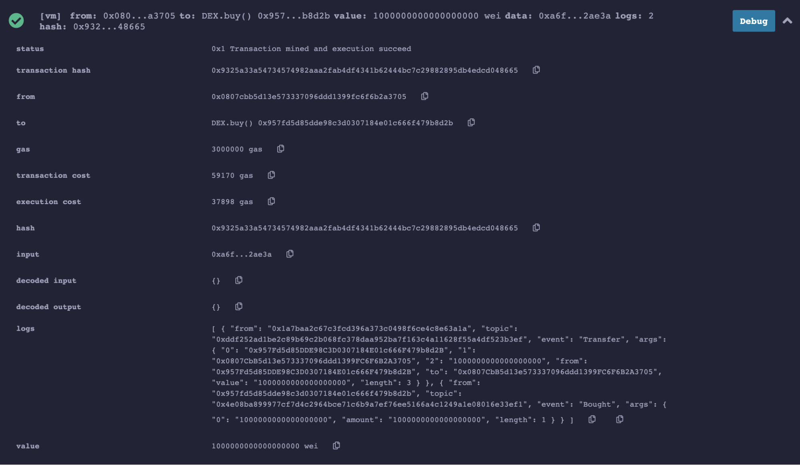
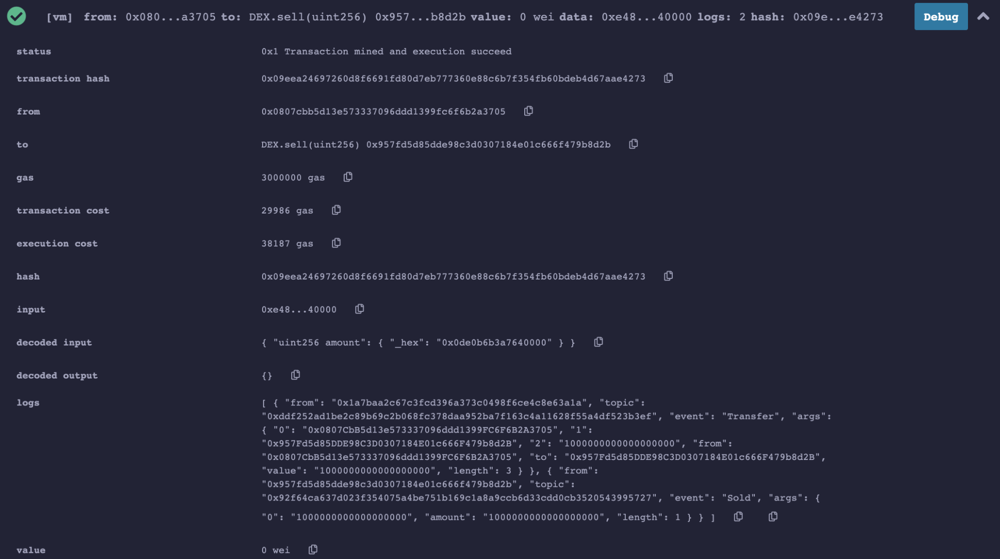

### Starting point

`SafeYorkERC20Token.sol`

```js
// SPDX-License-Identifier: MIT

pragma solidity ^0.6.10;

import "https://github.com/OpenZeppelin/openzeppelin-contracts/blob/master/contracts/math/SafeMath.sol";


interface IERC20 {

    function totalSupply() external view returns (uint256);
    function balanceOf(address account) external view returns (uint256);
    function allowance(address owner, address spender) external view returns (uint256);

    function transfer(address recipient, uint256 amount) external returns (bool);
    function approve(address spender, uint256 amount) external returns (bool);
    function transferFrom(address sender, address recipient, uint256 amount) external returns (bool);
    event Transfer(address indexed from, address indexed to, uint256 value);
    event Approval(address indexed owner, address indexed spender, uint256 value);
}

contract  YorkERC20Token is IERC20{
    // use SafeMath library
    using SafeMath for uint256;
    // Track how many tokens are owned by each address.
    mapping (address => uint256) public override balanceOf;

    string public name = "York Token";
    string public symbol = "YTN";
    uint8 public decimals = 18;

    uint256 public override totalSupply = 1000000 * (uint256(10) ** decimals);

    event Transfer(address indexed from, address indexed to, uint256 value);

    constructor() public {
        // Initially assign all tokens to the contract's 
// creator.
        balanceOf[msg.sender] = totalSupply;
        emit Transfer(address(0), msg.sender, totalSupply);
    }

    function transfer(address to, uint256 value) public override returns (bool success) {
        require(balanceOf[msg.sender] >= value);

        balanceOf[msg.sender] = balanceOf[msg.sender].sub(value);  // deduct from 
// sender's balance
        balanceOf[to] = balanceOf[to].add(value);          // 
// add to recipient's balance
        emit Transfer(msg.sender, to, value);
        return true;
    }

    event Approval(address indexed owner, address indexed spender, uint256 value);

    mapping(address => mapping(address => uint256)) public override allowance;

    function approve(address spender, uint256 value)
        public  override
        returns (bool success)
    {
        allowance[msg.sender][spender] = value;
        emit Approval(msg.sender, spender, value);
        return true;
    }

    function transferFrom(address from, address to, uint256 value)
        public override
        returns (bool success)
    {
        require(value <= balanceOf[from]);
        require(value <= allowance[from][msg.sender]);

        balanceOf[from] = balanceOf[from].sub(value);
        balanceOf[to] = balanceOf[to].add(value);
        allowance[from][msg.sender] = allowance[from][msg.sender].sub(value);
        emit Transfer(from, to, value);
        return true;
    }
}
```

### Description

- Use [remix](https://ethereum.remix.org) to solve this assignment.
- Create a simple decentralized exchange(DEX) contract that will deploy `YorkERC20Token`. You can use the below skeleton for DEX. You can read more about decentralized exchange [here](https://blog.coinmarketcap.com/2018/09/06/decentralized-exchanges-101-all-you-need-to-know/).

`DEX.sol`

```js

// SPDX-License-Identifier: MIT

pragma solidity ^0.6.10;

import “SafeYorkERC20Token.sol”;

contract DEX {

    IERC20 public token;

    event Bought(uint256 amount);
    event Sold(uint256 amount);

    constructor() public {
        token = new YorkERC20Token();
    }
    
    function buy() payable public {
        // TODO
    }
    
    function sell(uint256 amount) public {
        // TODO
    }

}
```

- This DEX will have all the token reserves available. You need to implement two functions:
1. `buy` 
    - Caller can send Ether and get token in return
    - You will have to first check the amount of Ether the message contains and verify that the contracts own enough tokens and that the message has some Ether in it.
    - If the contract holds enough tokens it’ll send the number of tokens to the caller and emit the Bought event.
    - If you will call the require function in the case of an error the - Ether sent will directly be reverted and given back to the caller.
    - For simplicity, implement the logic to just exchange 1 token for 1 Ether.
    - If the buyer is successful, you will see two events (Transfer and Bought) in remix similar to sample shown below:

    

2. `sell`

    - Caller can send token back in exchange of Ether
    - The caller will have to approve the amount by calling approve function(At Address is used to access a contract that has already been deployed. It assumes that the given address is an instance of the selected contract) 
    - Check if the transfer from the caller address to the contract address was successful when sell function is invoked.
    - Send the Ethers back to the caller address.
    - If seller is successful, you will see two events (`Transfer` and `Sold`) in remix similar to sample shown below:

    

Submit your complete solution (DEX.sol) to the dropbox.
